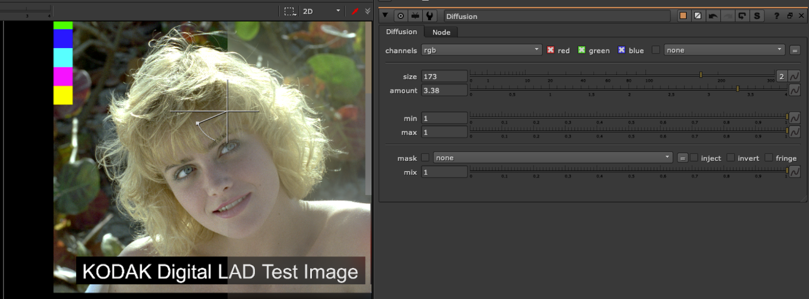

# Diffusion TL

**Author:** Tony Lyons - [https://compositingmentor.com](https://compositingmentor.com)

Simple tool that mixes in the result of the blurred image with controls for bringing back min and max values. Simulating a lens FX.
