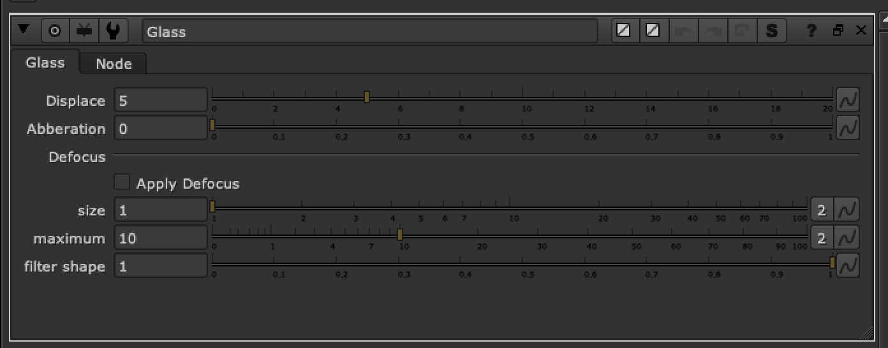

# Glass FR

**Author:** Frank Rueter - [http://www.ohufx.com](http://www.ohufx.com)

- [http://www.nukepedia.com/gizmos/transform/glass](http://www.nukepedia.com/gizmos/transform/glass)

This gizmo uses IDistort to create a simple glass light effect based on a control mask.

