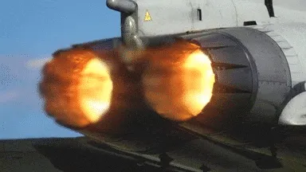
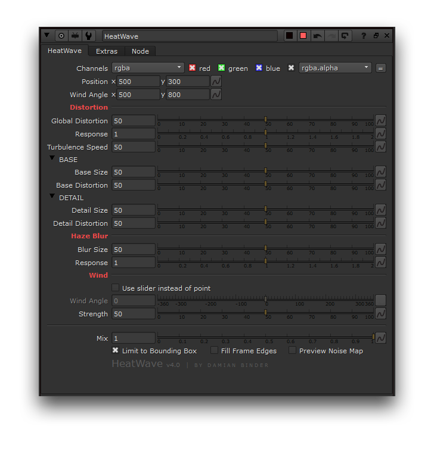
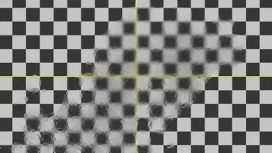
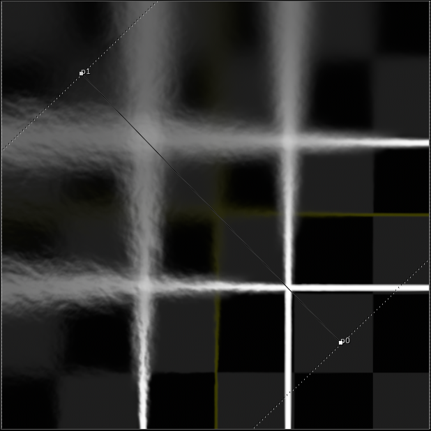
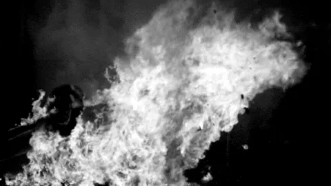

# HeatWave DB

**Author:** Damian Binder

- [http://www.nukepedia.com/gizmos/filter/realheatdistortion](http://www.nukepedia.com/gizmos/filter/realheatdistortion)

HeatWave is a gizmo created by Damian Binder that simulates realistic heat distortion you often see around fire or other sources of heat.

