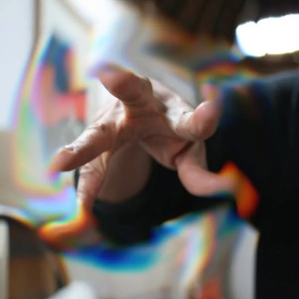
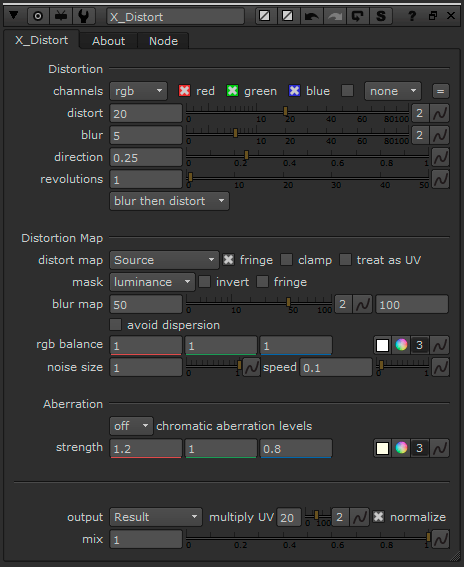

# X_Distort XM

**Author:** Xavier Martin - [http://www.xaviermartinvfx.com/articles/](http://www.xaviermartinvfx.com/articles/)

- [http://www.nukepedia.com/gizmos/transform/x_distort](http://www.nukepedia.com/gizmos/transform/x_distort)
- [http://www.xaviermartinvfx.com/x_distort/](http://www.xaviermartinvfx.com/x_distort/)

This gizmo allows you to distort images with control and flexibility. It is more customizable and easier to use than Nuke's IDistort. You don't need to copy any channels and you have many other controls to play with. You can blur the parts of the image which are being distorted to get a smoother result.

You can distort an image using its own channels, using another image or using an automatic noise. You can choose the detail of the deformation.

You can distort each color per separate, creating a realistic chromatic aberration effect. You can decide the quality of the effect in order to speed up render times.

