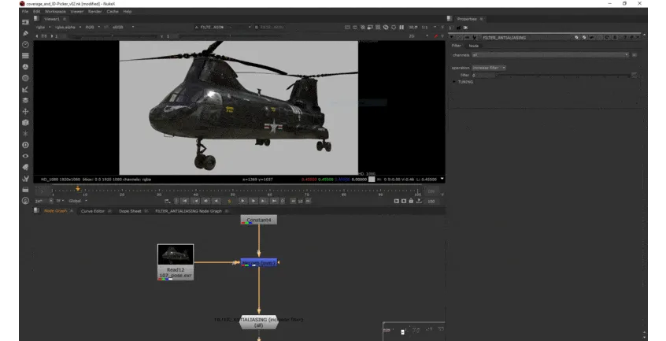

# AntiAliasFilter AG

**Author:** Andrea Geremia - [http://www.andreageremia.it/tutorial.html](http://www.andreageremia.it/tutorial.html)

- [http://www.nukepedia.com/gizmos/filter/antialiasing-filter](http://www.nukepedia.com/gizmos/filter/antialiasing-filter)

Increase or Decrease Antialiasing filter.

**Instructions:**
1. Select channels. You can just apply to the edge in your alpha channel or also to the RGB
2. Decide the operation (increase or reduce)
3. Move slider to select size of the filter
4. Use gamma for a better tuning
This gizmo uses a 3x3 Matrix.

