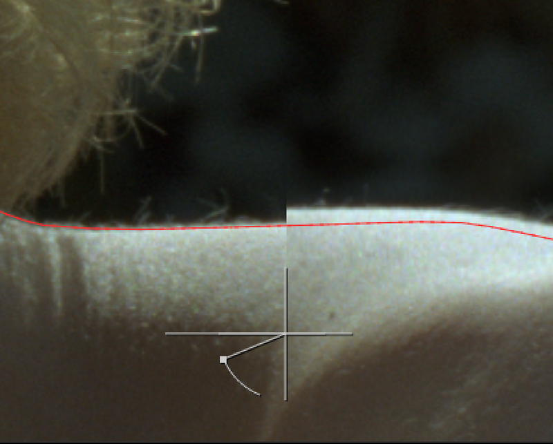
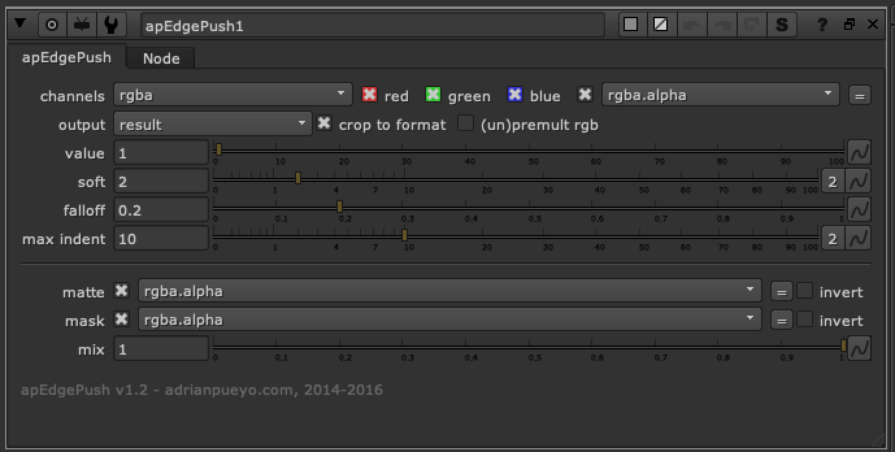

# apEdgePush AP

**Author:** Adrian Pueyo - [http://www.adrianpueyo.com/](http://www.adrianpueyo.com/)

apEdgePush is a vector distort edge warp that warps the edge to try and get right of fringe colors. By default looks for alpha in the img input but you can plug in a custom matte to the matte input. Switch channels to rgb and warp before the premult in order to warp the image "within" the premulted alpha region.

