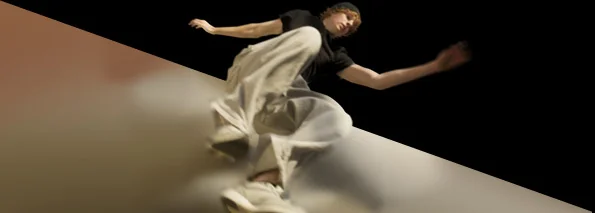
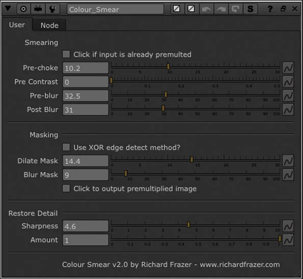

# ColourSmear NKPD

**Author:** Richard Frazer

- [https://github.com/RichFrazer/colour-smear-for-Nuke/blob/master/colour-smear.nk](https://github.com/RichFrazer/colour-smear-for-Nuke/blob/master/colour-smear.nk)

Smear out the edge colour of your A plate to create better soft edges. Works by blurring and un-premultiplying your image.

I have seen different artists do similar techniques in a number of ways, but this is my take on it (the EdgeExtend gizmo is a simpler version – this one combines the edge erosion aspect and produces softer results). This technique is not application specific, but I am demonstrating it here in Nuke (although I doubt you could do this in After Effects as you need to be able to manually control pre-multiplication).

