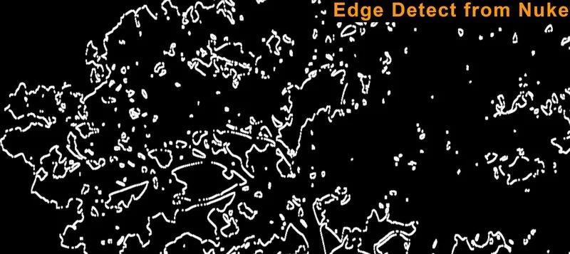
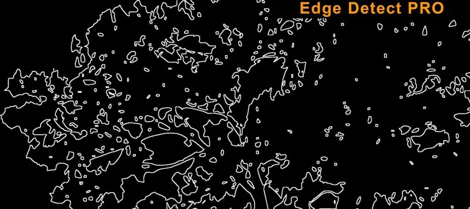

# EdgeDetectPRO AG

**Author:** Andrea Geremia - [http://www.andreageremia.it/tutorial.html](http://www.andreageremia.it/tutorial.html)

- [http://www.nukepedia.com/gizmos/filter/edgedetect-pro](http://www.nukepedia.com/gizmos/filter/edgedetect-pro)
- [http://www.andreageremia.it/tutorial_edge_rim_light.html](http://www.andreageremia.it/tutorial_edge_rim_light.html)

EdgeDetect PRO is an evolution of the classic node from Nuke. Here you have more options to get a better result with thinner edge reveal.

