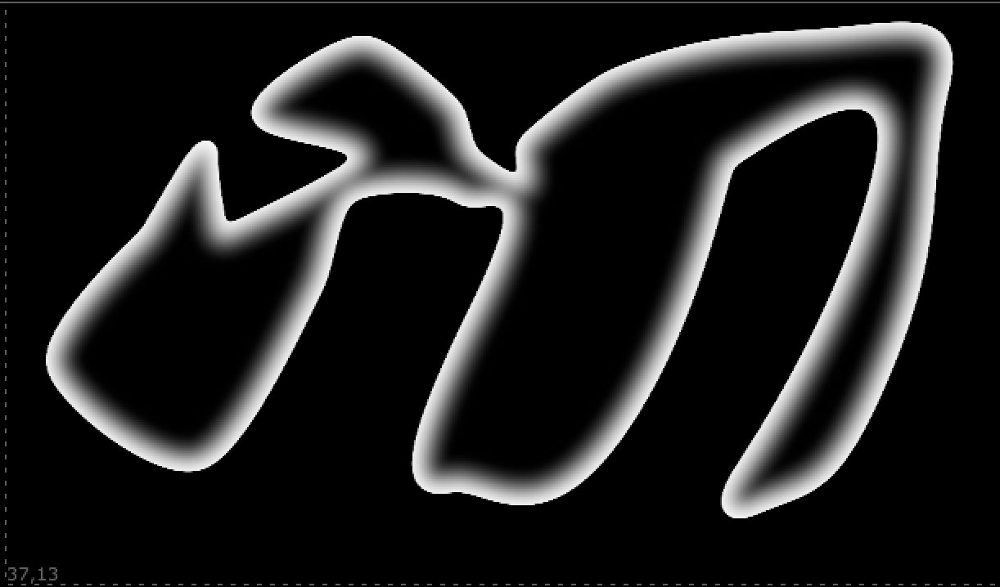
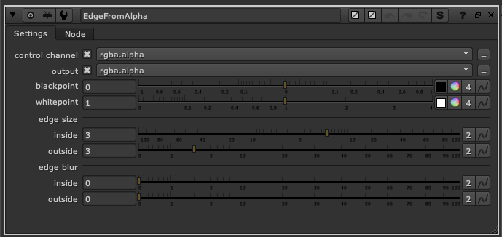

# EdgeFromAlpha FR

**Author:** Frank Rueter - [http://www.ohufx.com](http://www.ohufx.com)

- [http://www.nukepedia.com/gizmos/filter/edgefromalpha/](http://www.nukepedia.com/gizmos/filter/edgefromalpha/)

This tool is an edge detect on the alpha channel that has separate adjustable erode and blur controls for both inside and outside of the matte.

