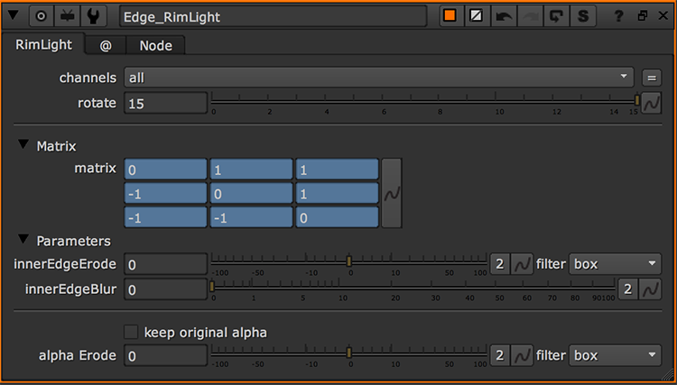
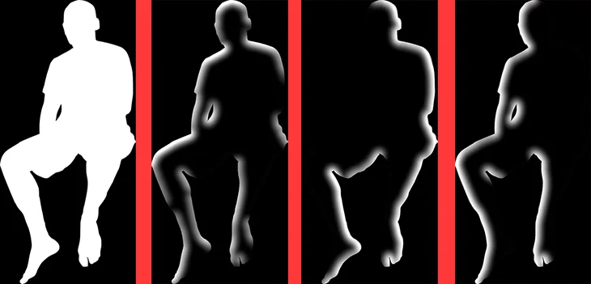

# Edge_RimLight AG

**Author:** Andrea Geremia - [http://www.andreageremia.it/tutorial.html](http://www.andreageremia.it/tutorial.html)

- [http://www.nukepedia.com/gizmos/filter/edge-rim-light](http://www.nukepedia.com/gizmos/filter/edge-rim-light)

With this tool you can create a quick mask for your Rim Light. Move the slider rotate and that's it! Use the Parameters to modify the size and the softness of the edge.

