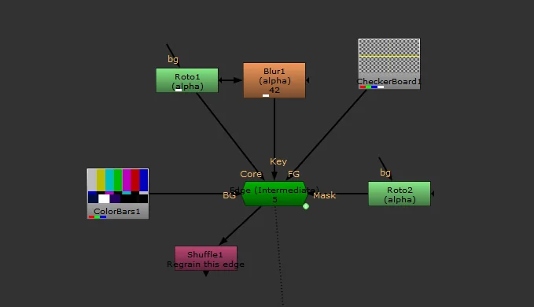
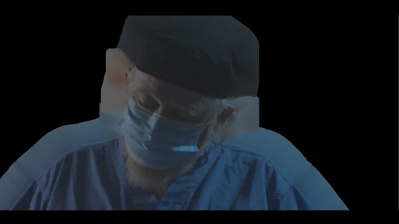

# Edge RB

**Author:** Rob Bannister - [http://www.bannisterpost.com/blog/](http://www.bannisterpost.com/blog/)

- [http://www.nukepedia.com/gizmos/filter/edge](http://www.nukepedia.com/gizmos/filter/edge)
- Video: [https://youtu.be/QXOMe_7fAmw](https://youtu.be/QXOMe_7fAmw)

Edge allows you to extend the proper color out over transparent edges or areas with a lot of motionblur without eroding away the nice detail. This edge extend has some more advanced features like splitting the core matte and final key which allows you to work on motion blur without affecting small details like hair or a swinging rope for example. There is also more control over how you blend the core detail to the extended edge color. This was shown to me years ago by an old comp sup I had and is the same as the edge extend by Frank Reuter. This is my version of it that has evolved a little bit over the years.

