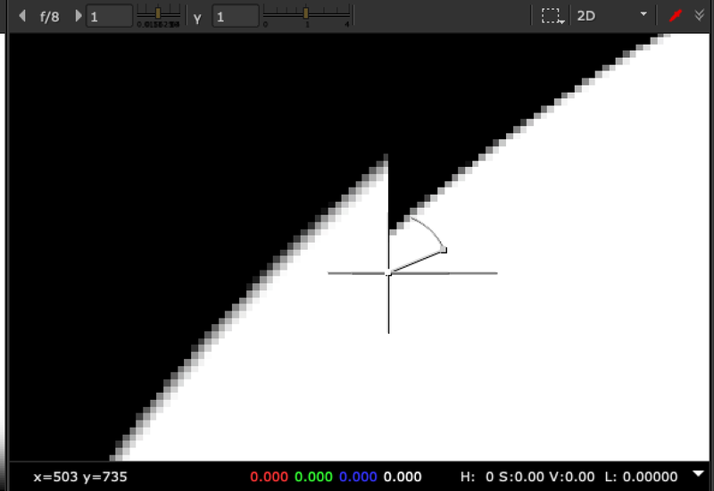
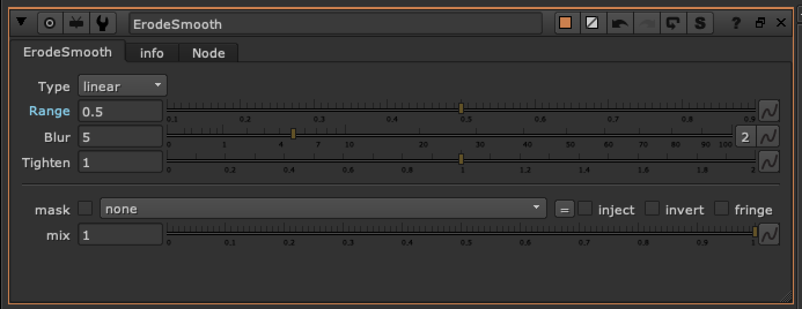

# ErodeSmooth TL

**Author:** Tony Lyons - [https://compositingmentor.com](https://compositingmentor.com)

This erode uses a method of blurring the alpha, then uses colorlookup node to tighten the edge back down. The range slides along the full area of the blurred region. Best when used with tight rotos / edges without much blur or falloff.

