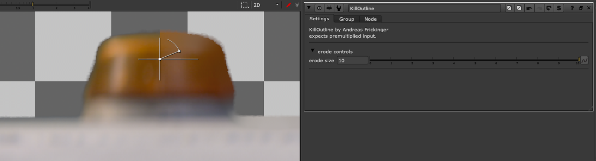

# KillOutline NKPD

**Author:** Andreas Frickinger

- [http://www.nukepedia.com/gizmos/keyer/killoutline/](http://www.nukepedia.com/gizmos/keyer/killoutline/)

Erodes/Expands rgb edges of keyed image image to get rid of unwanted outlines. Includes fine tuning for edge treatment. Based on Frank Rueter's Edge Extend.

