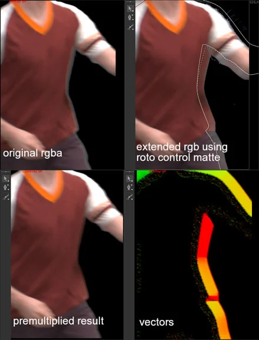

# VectorExtendEdge NKPD

**Author:** Michael Garrett

- [http://www.nukepedia.com/gizmos/filter/vectorextendedge/](http://www.nukepedia.com/gizmos/filter/vectorextendedge/)

Pushes rgb pixels outwards using vectors generated perpedicular to a control matte edge. It's similar to Frank Reuter's EdgeExtend gizmo but instead of recursively blurring and unpremulting, it recursively generates vectors based on the input control matte and uses VectorBlur to push the rgb pixels outwards.

To get the best results, you need to input a matte that conforms to the pixels you want to extend.

