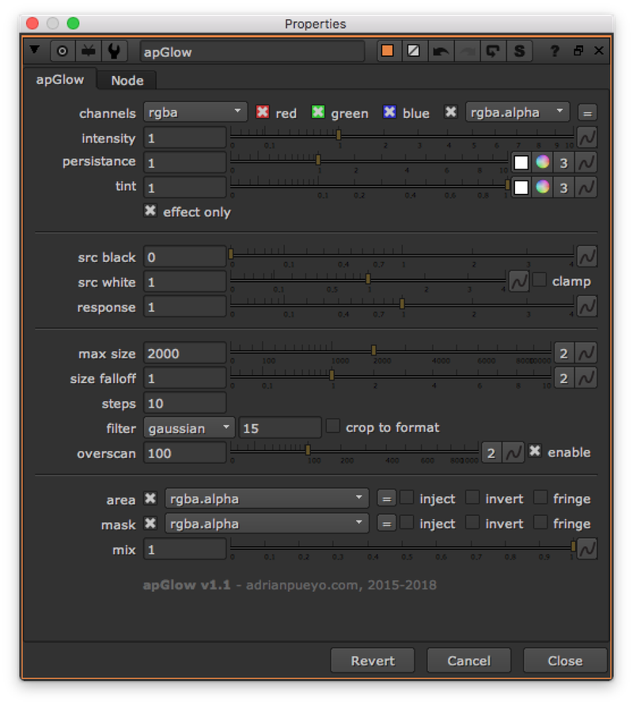

# apGlow AP

**Author:** Adrian Pueyo - [http://www.adrianpueyo.com/](http://www.adrianpueyo.com/)

- [http://www.nukepedia.com/gizmos/filter/apglow](http://www.nukepedia.com/gizmos/filter/apglow)

apGlow is a lightweight exponential glow effect with advanced control over the steps, falloff, distribution, color and other useful parameters.

