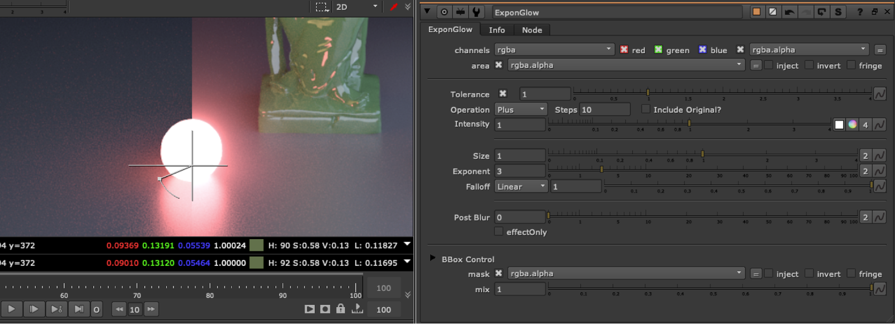

# ExponGlow TL

**Author:** Tony Lyons - [https://compositingmentor.com](https://compositingmentor.com)

There are many Glow tools out there, Here are some of the features that makes this one unique:
- Iterable Blur steps, adds more or less blurs as you change the steps number
- Uses percentage blurs, meaning the blur ratio scales along with your format, so when changing from a 2K plate to a 4K plate, the Glow should look the same
- Different types of Merge operations to choose from: Screen, Plus, Over, Hypot, Average, Max, Min (Can include original image in Merge)
- Different type of falloff to choose from, similar to ramp or roto falloff: Linear, pLinear, Smooth, Smooth0, Smooth1
- Tolerance option (luma key on input) and Area mask input, so you can use mattes/rotos to isolate which part of the image glows
- BBox optimization, which has a safe BBox mode that will stop the bbox from growing 10% beyond the format size (or input BBox size, whichever is bigger). You can adjust this amount, or change to pixels instead of percent. And final BBox adjustment, so you can further grow/shrink the final bbox (in percent or pixels).

The focus was on an exponential Glow that has a lot of control and lookDev options in the type of falloff, size, and amount, while still paying attention to Bounding Box size and calculation time.
