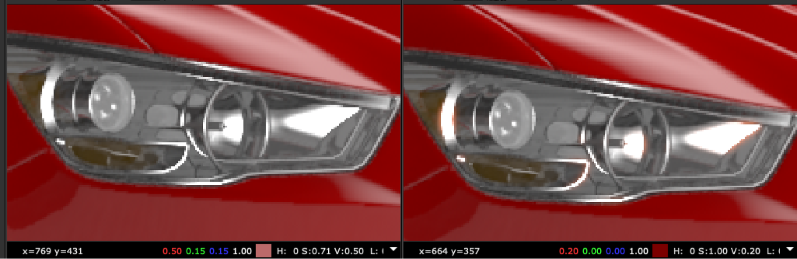

# Halation TL

**Author:** Tony Lyons - [https://compositingmentor.com](https://compositingmentor.com)

Simple tool to introduce a little halation effect. Adjusts amount of r,g,b channels individually with an overall blur. Blackpoint and whitepoint sliders are the low and high of a luminance key threshold for where the effect starts. You can output final, effect only, and luma key.

