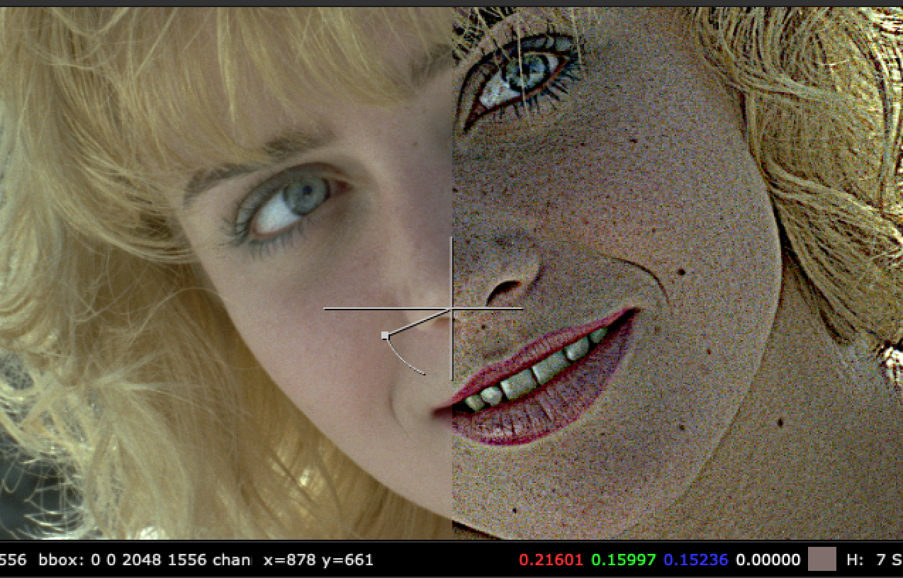
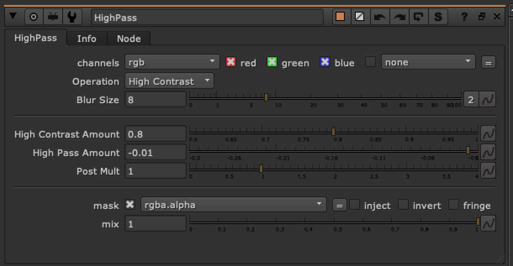

# Highpass TL

**Author:** Tony Lyons - [https://compositingmentor.com](https://compositingmentor.com)

Gives you the difference between a blurred input and the original input. Making small details quite noticeable.

The 2 main uses are:
1. To aid 2d tracking
2. To apply a different type of sharpen filter to an image

