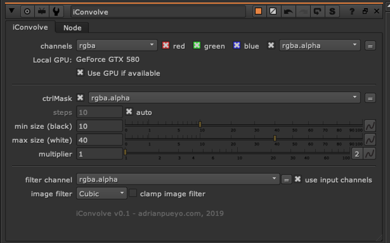
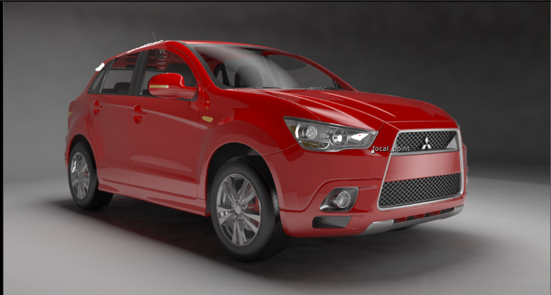

# iConvolve AP

**Author:** Adrian Pueyo - [http://www.adrianpueyo.com/](http://www.adrianpueyo.com/)

Similar to the iBlur, but with a convolve (defocus)! Uses a control mask and a custom filter/kernel to create a convolve effect with a falloff. Ramps off from 0-1, 0 will have the min size convolve, 1 will have the max size convolve.

