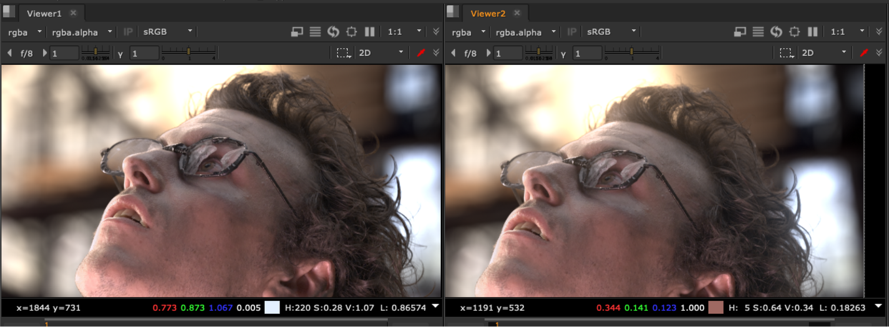
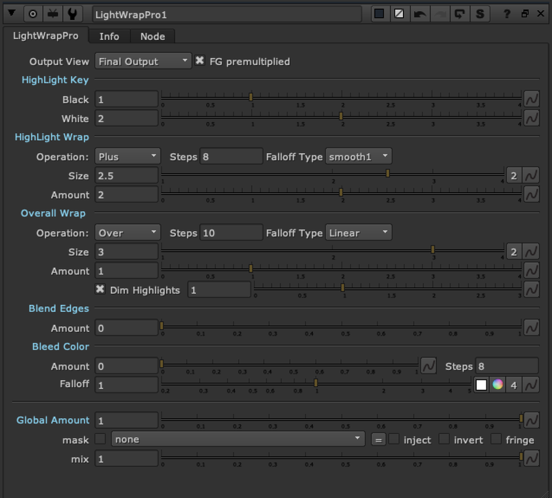

# LightWrapPro TL

**Author:** Tony Lyons - [https://compositingmentor.com](https://compositingmentor.com)

This lightwrap tool evolved from luma pictures Fuse node, but as a stand alone lightwrap. The features that set this tool apart: Exponential blurring with adjustable steps, a Highlight Wrap and Overall Wrap, blend edges and bleed color options (idea from luma's fuse). Multiple output views to help you work step by step with the workflow of the tool.

