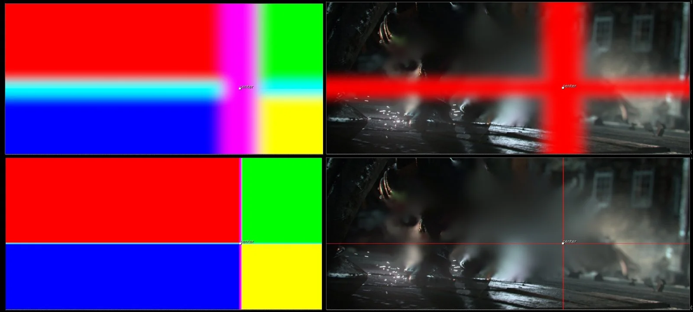

# MECfiller NKPD

**Author:** Matthias Eckhardt

<video autoplay loop muted playsinline style="width:100%">
  <source src="../img/tools/filter/mec-filler-3.mp4" type="video/mp4">
</video>

- [http://www.nukepedia.com/gizmos/draw/mecfiller](http://www.nukepedia.com/gizmos/draw/mecfiller)

Multi-directional hole filling tool with various modes and controls.

