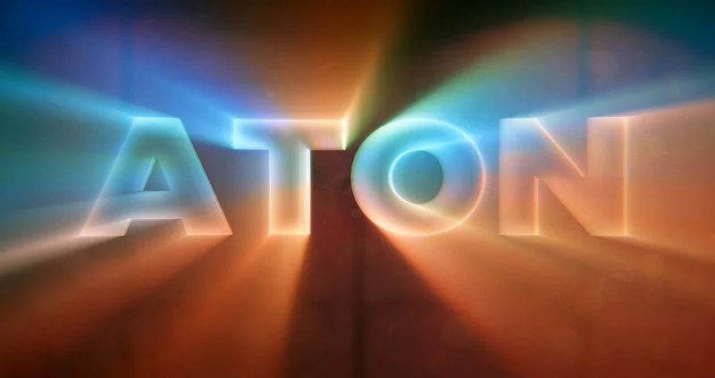

# X_Aton XM

**Author:** Xavier Martin - [http://www.xaviermartinvfx.com/articles/](http://www.xaviermartinvfx.com/articles/)

- [http://www.nukepedia.com/blink/filter/x_aton](http://www.nukepedia.com/blink/filter/x_aton)
- [http://www.xaviermartinvfx.com/x_aton/](http://www.xaviermartinvfx.com/x_aton/)

This tool is an advanced variation on the God Rays node. It creates volumetric lighting effects with more realism. It supports soft and diffused light rays created by area lights and volumetric lights. It supports Nuke 3D Cameras, Point Lights and Axis to have a better control of the direction of the illumination.

It supports Nuke 3D Cameras, Point Lights and Axis to have a better control of the direction of the illumination. The tool can also be used as a simple screen-space extruder, to create apparent 3D texts or extruded shapes. Now you can do WordArt from the 90s inside of Nuke!

All of this using the power of the GPU to speed up the calculations.

