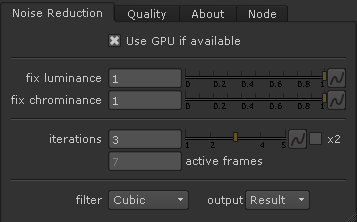
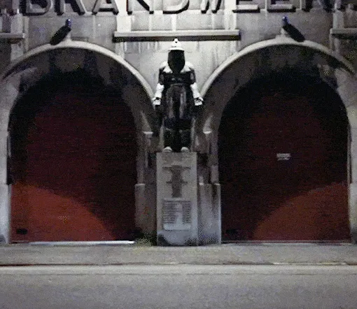
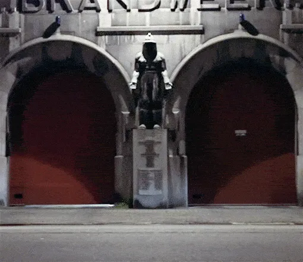

# X_Denoise XM

**Author:** Xavier Martin - [http://www.xaviermartinvfx.com/articles/](http://www.xaviermartinvfx.com/articles/)

- [http://www.nukepedia.com/gizmos/filter/x_denoise](http://www.nukepedia.com/gizmos/filter/x_denoise)
- [http://www.xaviermartinvfx.com/x_denoise/](http://www.xaviermartinvfx.com/x_denoise/)

X_Denoise is a noise reduction gizmo that can be used to repair damaged or compressed footage. It does the same function of the Nuke Denoise, but using a different algorithm that can sometimes provide better results.

While most de-noisers try to work out which small pixels are susceptible to be noisy, the X_Denoise averages different frames in order to smooth the noise, making it invisible to the eye. The gizmo offers multiple settings to take control over how many frames are being used and how much detail is preserved.

