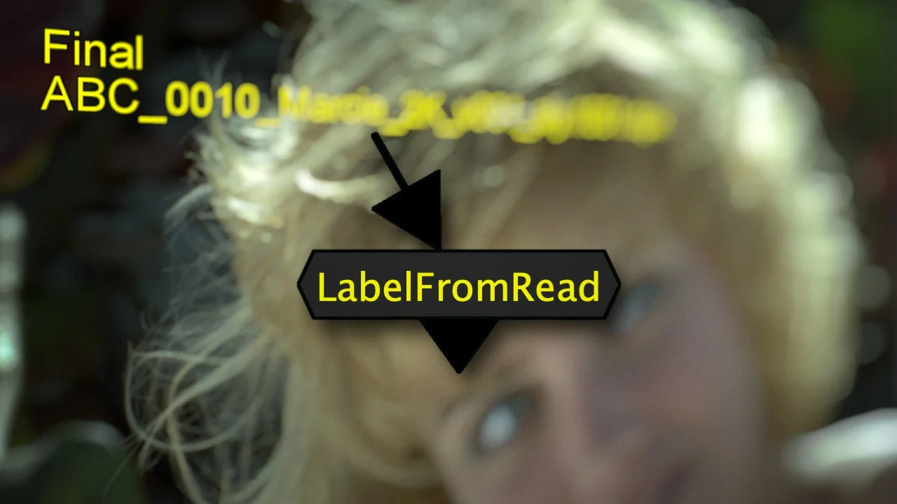
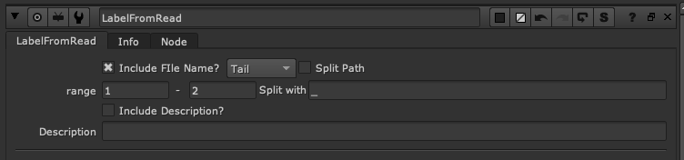

# LabelFromRead TL

**Author:** Tony Lyons - [http://www.CompositingMentor.com](http://www.CompositingMentor.com)

- [http://www.nukepedia.com/gizmos/image/labelfromread](http://www.nukepedia.com/gizmos/image/labelfromread)

Displays Filepath of topmost read node over the image. Useful when viewing sequence contact sheets / matching shots.

Includes some split path variables to help grab the section of the filepath that you need. Check split path, choose the character you'd like to split with ( _ , . - / etc) and the range you'd like to grab, 0-1 will grab first 2 items for example.

Can also choose to split the full path or just the tail (The part after the last / in the filepath)
Should allow quick and useful file splitting that you can change on the fly without needing to remember the split tcl code.

