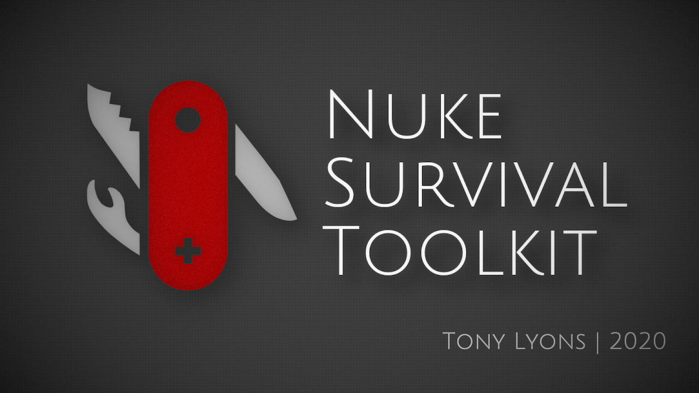

# Nuke Survival Toolkit Documentation

`Release v2.1.0`

For online documentation visit [Nuke Suvival Toolkit Documentation](https://creativelyons.github.io/mkDocsTest/documentation/site/)

## About

The Nuke Survival Toolkit is a portable tool menu for the Foundry’s Nuke with a hand-picked selection of nuke gizmos collected from all over the web, organized into 1 easy-to-install toolbar.

