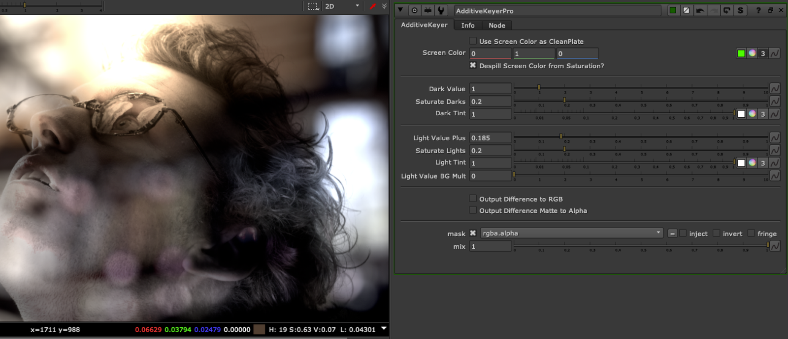
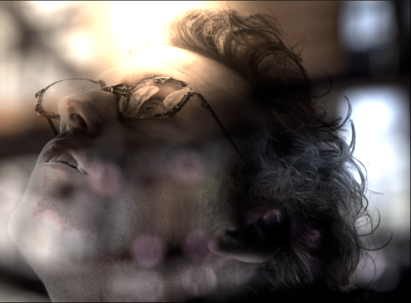
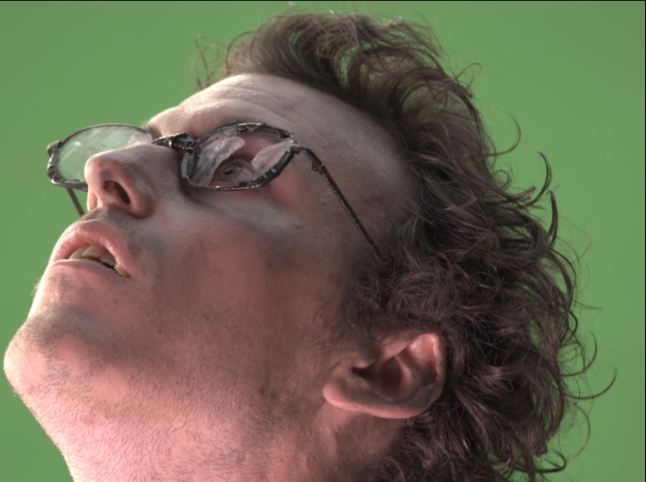

# AdditiveKeyerPro TL

**Author:** Tony Lyons - [https://www.CompositingMentor.com](https://www.CompositingMentor.com)

Additive Keyer pro does an additive key, which finds the highs and lows from the difference of a cleanplate and the original greenscreen plate and lightens / darkens the BG image. This process is handy for capturing subtle details in edges, such as hair and motionblur.

There are many additivekeyers, but this one has some unique features:
1. The light values have a plus and BG mult slider, giving you more control over highlights
2. The dark values uses a divide/multiply technique on the bg, preventing negative values
3. Option to keep some saturation from the original colors, with a screen color picker to help remove green/blue spill from the edges if you choose to keep saturation.
4. Options to output the difference to RGB, and difference matte to alpha, to use other comp techniques
### Inputs:
- **FG** - Foreground plate
- **Clean** - Clean plate
- **BG** - Background plate
- **Result** - Final composite output

