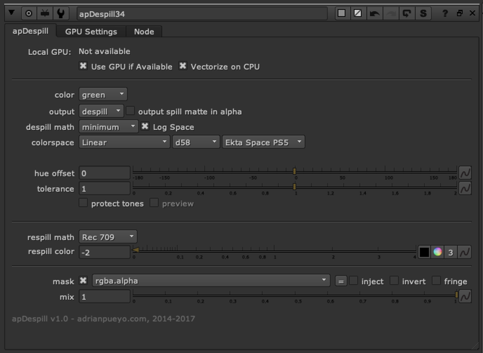

# apDespill AP

**Author:** Adrian Pueyo - [http://www.adrianpueyo.com/](http://www.adrianpueyo.com/)

- [http://www.nukepedia.com/blink/colour/apdespill](http://www.nukepedia.com/blink/colour/apdespill)

Nuke gizmo made to despill an image, with options to despill any hue (and not only the primaries), select different algorithms for de/re-spilling, and protect tones from the despill. All coded in Blinkscript.
### Features:
- Choose a custom color
- Despill math
- Output a despillMatte
- Swap colorspaces before/after
- Despill in log Space
- Adjust hue before/after
- Adjust tolerance
- Protect tones for extra level of precision
- Adjust respill color
- Mask/mix
v2.0 supports image based despilling, and can toggle the colorspace options on/off for testing

