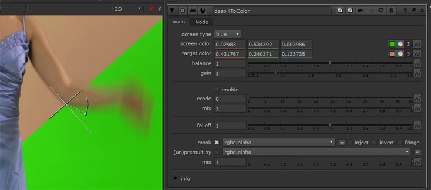

# DespillToColor NKPD

**Author:** Johannes Masanz - [http://www.johannesmasanz.com](http://www.johannesmasanz.com)

- [http://www.nukepedia.com/toolsets/colour/despill-to-color](http://www.nukepedia.com/toolsets/colour/despill-to-color)
- [http://www.vimeo.com/despillToColor](http://www.vimeo.com/despillToColor)

If you are trying to fix an object's edge, by bringing back its original color, then this tool is perfect for you! DespillToColor is designed to work best with a specific user defined screen color and therefore a good local solution for certain areas of your plate.
### Usage:
- Pick a blue/greenscreen color - set or pick a target color.
- **'balance'** controls how much red tones are being affected by the despill operation opposed to blue and green tones.
- Increasing the **'gain'** will affect a wider range of colors, like the finetune knob in DespillMadness.
- **'erode'** and **'falloff'** sometimes work well for increasing the effect in defocussed areas. I usually go for ramping up the 'gain' OR the 'erode', rarely both.
### Example pics:
(For testing I recommend blurring these jpegs a little to get rid of compression artefacts.)
- [http://johannesmasanz.com/files/despillToColor/greenscreen.jpg](http://johannesmasanz.com/files/despillToColor/greenscreen.webp)
- [http://johannesmasanz.com/files/despillToColor/bluescreen.jpg](http://johannesmasanz.com/files/despillToColor/bluescreen.webp)
