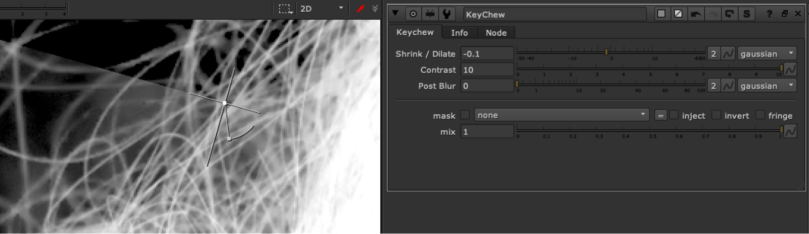

# KeyChew RK

**Author:** Rafal Kaniewski - [http://movingimagearts.com](http://movingimagearts.com)

- [http://movingimagearts.com/nuke-tools-london/](http://movingimagearts.com/nuke-tools-london/)
- [https://raw.githubusercontent.com/openNuke/toolset/master/keychew.nk](https://raw.githubusercontent.com/openNuke/toolset/master/keychew.nk)

Dilates and erodes a matte.

Good for subtly eroding in keyed edges. Can go negative and positive which erodes in and out. Equipped with mask and mix.
