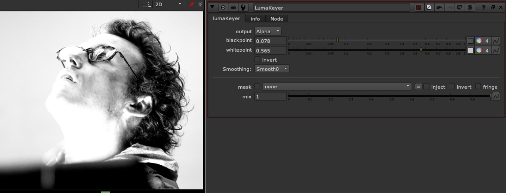

# LumaKeyer DR

**Author:** Derek Rein - [http://derekvfx.ca/nuke/](http://derekvfx.ca/nuke/)

- [https://github.com/DerekRein/.nuke/blob/master/ToolSets/lumaKeyer.nk](https://github.com/DerekRein/.nuke/blob/master/ToolSets/lumaKeyer.nk)

Original Tool by Derek Rein can be found on his github page.

Derek's tool is a simple slider controlled luminance keyer.
### Additional features added:
1. Output options of the result to alpha or rgba
2. Smoothing settings which mimic the smoothstep options found in a ramp, smooth, smooth0, and smooth1, using colorLookup curves
3. Mask and mix options
