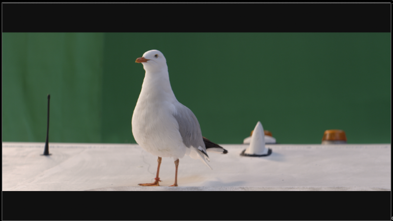

# SpillCorrect SPIN

**Author:** SPIN FX

- [https://github.com/SpinVFX/spin_nuke_gizmos/blob/master/gizmos/spin_tools/Keying/Spill_Correct2.gizmo](https://github.com/SpinVFX/spin_nuke_gizmos/blob/master/gizmos/spin_tools/Keying/Spill_Correct2.gizmo)
- Video: [https://vimeo.com/381270956](https://vimeo.com/381270956)

Use this tool to "despill" or mute colors introduced from Red/Green/Blue screens. Can replace the spill with a chosen color.

