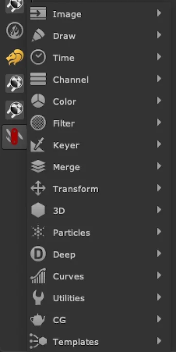
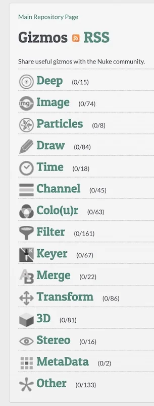

# Menus

The tool menu’s categorisation is laid out in a bit of a mix between Nuke’s original toolbar organisation, and Nukepedia’s gizmo categories.  This should be helpful and intuitive when browsing for certain types of tools, or to quickly find the tool you are looking for if you forget the name.  Some of these menus have sub-menus such as  `Filter/Glows/` for further groupings to reduce the overall list size of each menu.

| Nuke Survival Toolkit Menu Bar:			         | Nukepedia Menu Bar  |
| ---	                                          | --- |
|    |  |
