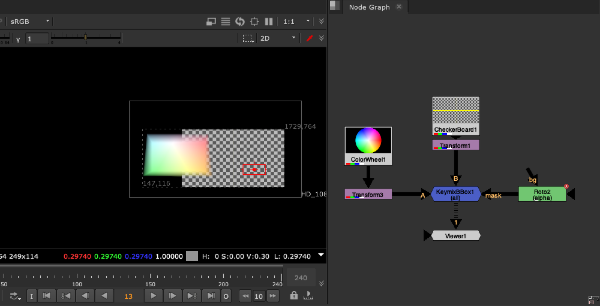

# KeymixBBox TL

**Author:** Tony Lyons - [https://www.CompositingMentor.com](https://www.CompositingMentor.com)

Same functionality as normal keymix, but with slightly better BBox management.

Nuke's keymix node takes into account the bbox's of the A, B, and mask inputs. In most cases you want the mask bbox to be ignored and that the maximum BBox result would be max bbox of A or B, and then an intersection of both A and B when the mask bbox is smaller.
