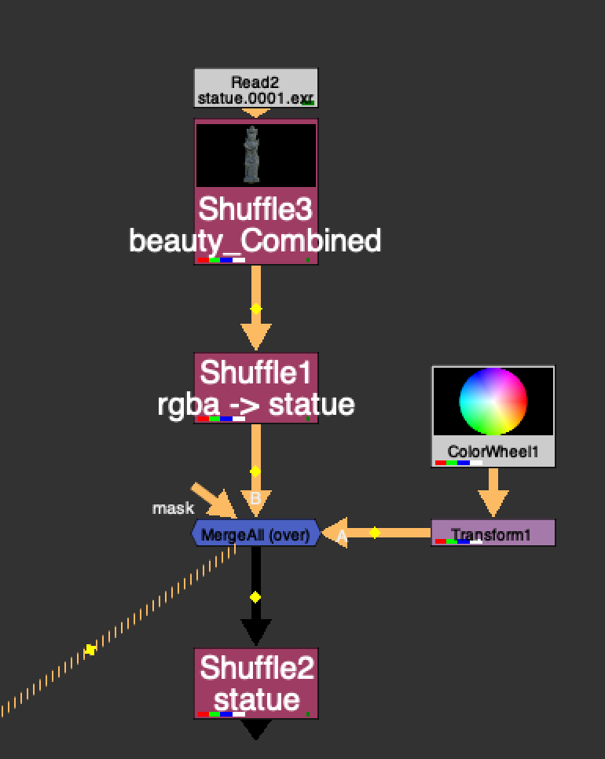

# MergeAll AP

**Author:** Adrian Pueyo - [http://www.adrianpueyo.com/](http://www.adrianpueyo.com/)

Many times when we are using an extra channel in the stream to pull out later to either use as a mask, DI matte, grain matte, etc. we have to manage that channel separately.

In this example, we have a statue matte channel that we want to pull out later, and we've over'ed a colorwheel. Normally you might have to add a channelMerge and stencil the colorWheel from the statue matte channel separately. MergeAll can save you this step. It basically adds all the channels from A stream to B stream and vice versa, ensuring that before merging, both streams contain the same exact channels. Because the colorWheel in this case now contains a "statue channel" which is black, when you mergeAll, it will merge "black" where the colorWheel is in the statue channel. So when you pull out the statue channel layer, it will appear as though the colorWheel is stenciled from the statue alpha.

This is sort of what you would expect to happen when you "merge All channels" in a merge node, but because sometimes the 2 streams don't have exactly the same channels, sometimes they get ignored. This helps solve that.

