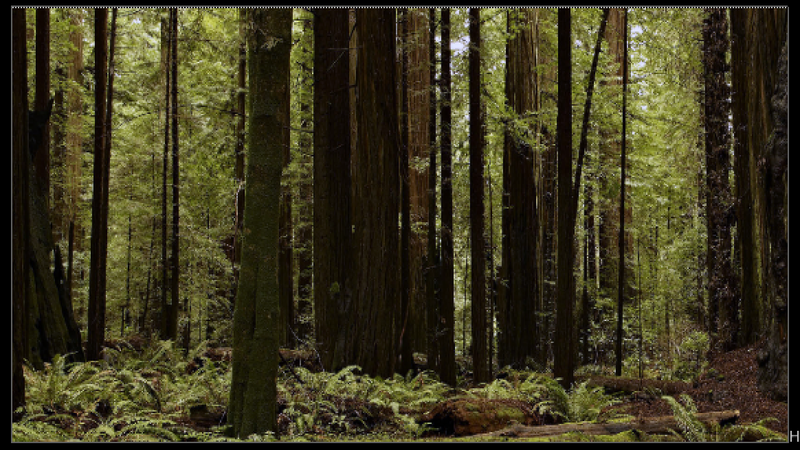
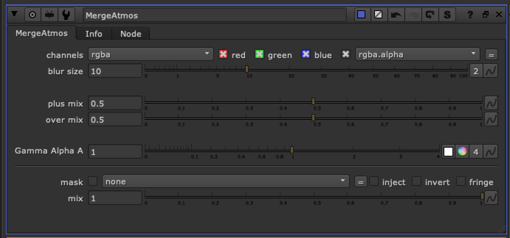
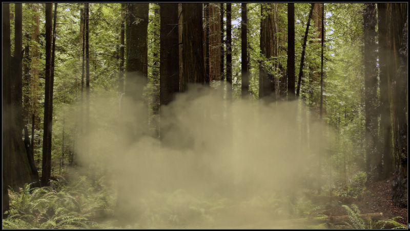

# MergeAtmos TL

**Author:** Tony Lyons - [https://www.CompositingMentor.com](https://www.CompositingMentor.com)

MergeAtmos is a merge for smoke, dust, and/or atmospheric effects. It has mixes of a merge(plus) and merge(over) exposed so you can find the right balance. The alpha of the smoke element is also driving a blur node that is simulating a bit of a diffusion effect.

