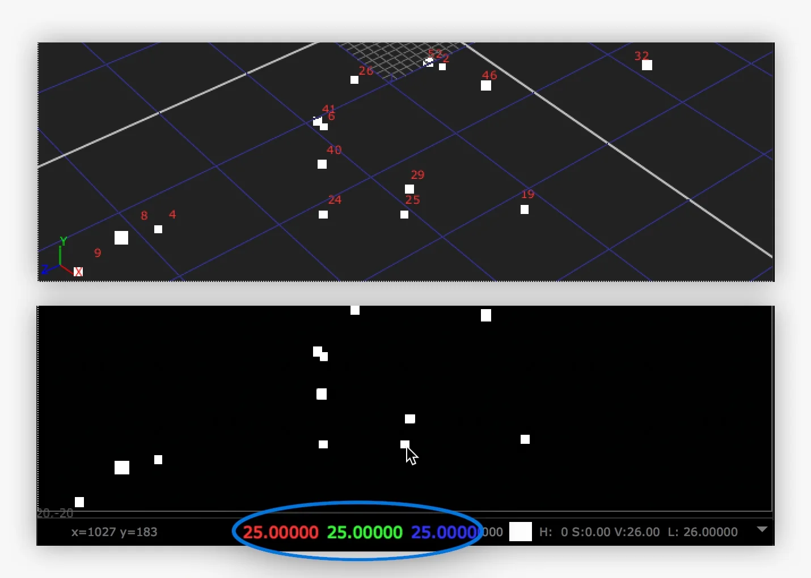

# ParticleKiller [NKPD]

**Author:** Wouter Gilsing - [http://www.woutergilsing.com](http://www.woutergilsing.com)

- [http://www.nukepedia.com/gizmos/particles/particlekiller](http://www.nukepedia.com/gizmos/particles/particlekiller)

A tool to kill specific particles based on their id.

Options to make identifying individual particles easier.

