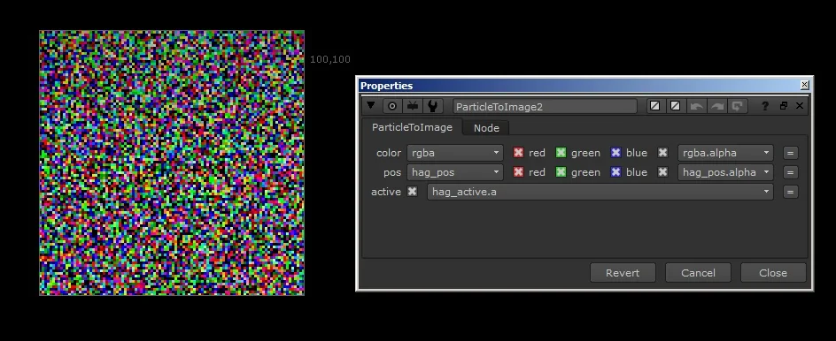
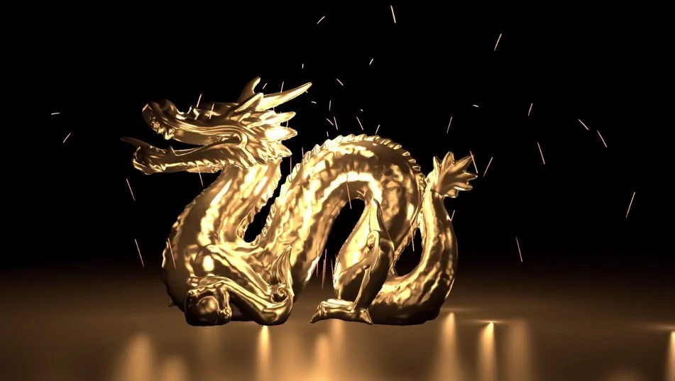

# ParticleLights [MHD]

**Author:** Mads Hagbarth Damsbo - [https://hagbarth.net/blog/](https://hagbarth.net/blog/)

- [http://www.nukepedia.com/blink/particles/particle-lights](http://www.nukepedia.com/blink/particles/particle-lights)
- [https://hagbarth.net/project/particle-lights/](https://hagbarth.net/project/particle-lights/)
- Video: [https://vimeo.com/96521727](https://vimeo.com/96521727)

Particle Lights is a custom relight node that enables particles to cast lights into a scene.

Using the new node "ParticleToImage" introduced in Nuke8 to relight a scene using particles.

