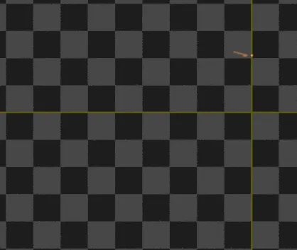
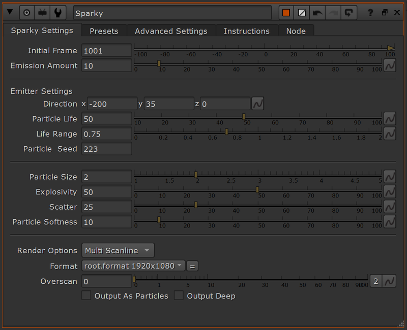
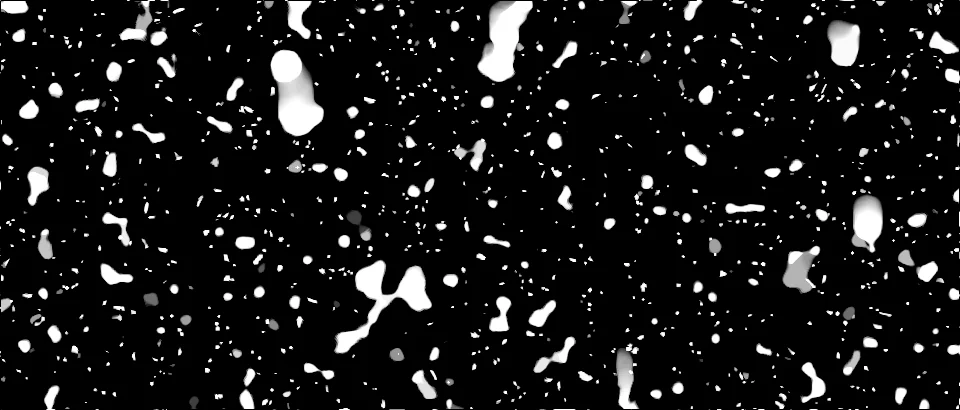
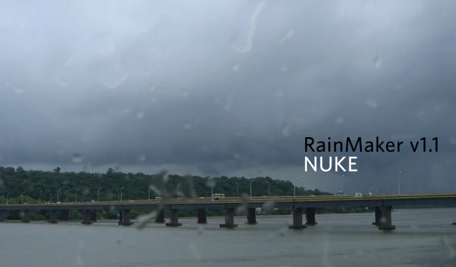

# Sparky [NKPD]

**Author:** Dimitri Breidenbach

- [http://www.nukepedia.com/gizmos/particles/db_sparky](http://www.nukepedia.com/gizmos/particles/db_sparky)
- Video: [https://vimeo.com/420973211](https://vimeo.com/420973211)

Easy to use particle setup to create sparks. Comes with a few animation presets.

Sparky is a pretty clean and simple setup to add sparks in your shot. It is a particle setup that is rendered through a ScanlineRender. The idea is that you can use it like a simple pre-rendered 2D Element coming from your favorite library, but, the main difference being that you can rotate the sparks, and give them the exact orientation you need.

This tool is delivered with an example .nk scene to see both 2D and 3D workflows.
### Features
**Axis and Cam input:** While the main goal is to be a 2D pre-rendered option, you can also select to use a 3D camera to track properly with your shot. In this case, you'll have to plug your Camera and an Axis to move the sparks in the 3D space.

**Presets:** While the look of the particles is very important, the emission rate is definitely a huge part of selling the sparks look. That is why, I decided to add 6 presets that can be loaded from the second tab. These presets will ask you to provide an initial frame and will then apply an animation to the 'Emission Amount' setting.
*Warning: Presets don't work in Nuke Non-Commercial due to some Python Limitation*
### Preset Types
- **Single Hit Heavy:** Heavy hit with a double pop
- **Single Hit Light:** Light pop of sparks
- **Welding:** Expression that will mimic a natural welding feeling
- **Wavy:** Constant sim with some strong variation in birth rate
- **Constant:** Softer variation than the Wavy preset
- **Loopy:** Loops the same pop animation of Sparks
**Output As Particles:** This will allow you to plug the particles into a Scene node. It will therefore not render any 2D preview anymore. If Sparky doesn't render anything, verify that you didn't check this box by error.
**Advanced Settings:** If you wish to have a wider spread of sparks, or if you decide to animate the Axis to which the sparks are attached, you can access a few settings that may interest you here.

The node is deep compatible if you keep it in MultiScanline mode (the default one), but if you want to be 200% sure you are in the right setting, you can check the 'Output Deep' option.

While this tool will never replace the real thing, it will definitely be more than enough when chucked in some background scene, or with some DoF or motionblur. Hopefully you will find some use for it and maybe even learn a little bit more about particles.

