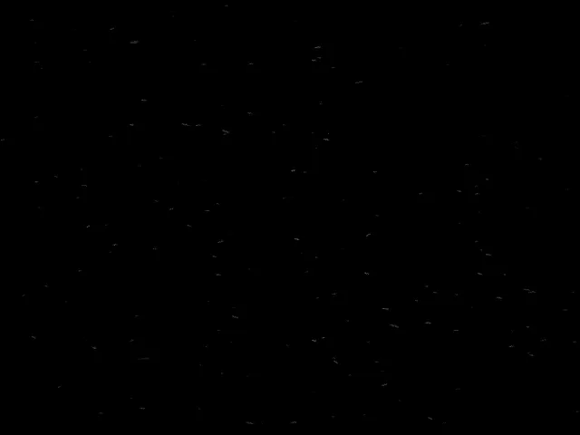
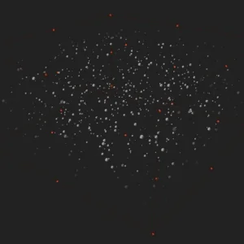
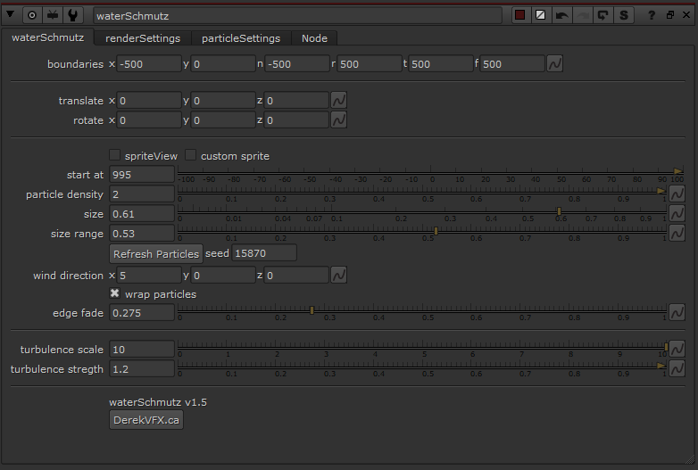

# WaterSchmutz [DR]

**Author:** Derek Rein - [http://derekvfx.ca/nuke/](http://derekvfx.ca/nuke/)

- [https://raw.githubusercontent.com/DerekRein/.nuke/master/ToolSets/schmutz.nk](https://raw.githubusercontent.com/DerekRein/.nuke/master/ToolSets/schmutz.nk)

WaterSchmutz is a quick and easy particle box to create floating (or static) particles with some built-in variation settings such as size and color.

Plug in a camera and an optional customSprite input.

