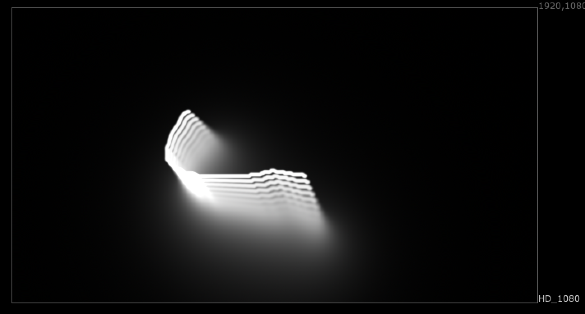

# apLoop AP

**Author:** Adrian Pueyo - [http://www.adrianpueyo.com/](http://www.adrianpueyo.com/)

Quick tool to simulate a loop effect while affecting the gain, blur and transformations on each "iteration".

Feel free to play with it and see its applications. Some of them: create an exponential (or normal) glow in seconds, an expo blur, a grid or mosaic (adding this gizmo twice), godrays, directional blurs, etc.
