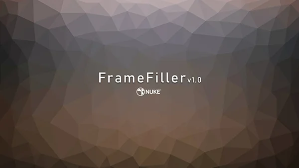

# FrameFiller MJT

**Author:** Mark Joey Tang - [https://www.facebook.com/MJTLab](https://www.facebook.com/MJTLab)

- [https://www.nukepedia.com/gizmos/time/framefiller](https://www.nukepedia.com/gizmos/time/framefiller)
- [https://github.com/xmjtx/MJTLab/tree/main/gizmo_library/Time/FrameFiller_v10](https://github.com/xmjtx/MJTLab/tree/main/gizmo_library/Time/FrameFiller_v10)

Using frame interpolation to fill up missing frames. Support multiple frames at once, support Regularized motion estimation, no NukeX Required. Motion blur, sub-frames bias adjustable.

