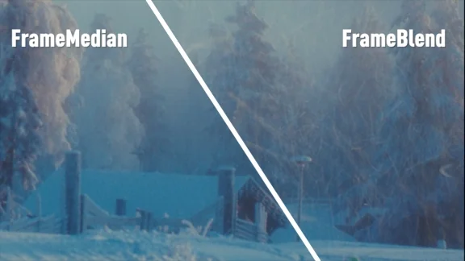

# FrameMedian MHD

**Author:** Mads Hagbarth Damsbo - [https://hagbarth.net/blog/](https://hagbarth.net/blog/)

- [http://www.nukepedia.com/blink/time/framemedian](http://www.nukepedia.com/blink/time/framemedian)
- [https://hagbarth.net/1054/](https://hagbarth.net/1054/)

FrameMedian is a temporal median toolset that calculates a median from a range of frames. Unlike the TemporalMedian tool that samples 3 frames, the FrameMedian can sample up to 20 frames.
### What is it for?

The tool is generally used for creating cleanplates from super very busy shots.

