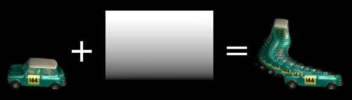

# TimeMachine NKPD

**Author:** Ivan Busquets

- [http://www.nukepedia.com/gizmos/time/timemachine](http://www.nukepedia.com/gizmos/time/timemachine)

Does a per-pixel time offset on the image, based on a secondary mask input.

This is sort of a copy of Houdini's Time Machine. Takes an image sequence plus a mask, then offsets the image in time based on the input mask as follows:
- Pixels with a mask value of 1 will be offset by the number of frames set in the "frames" knob.
- Mask values of 0 return the image at the current frame.
- Values between 0-1 will return an interpolated offset.
- Mask gets clamped to 0-1, so values <0 and >1 are not accounted for.

Very simple as it stands, but could be a good example of rebuilding a gizmo's internals using callbacks.

