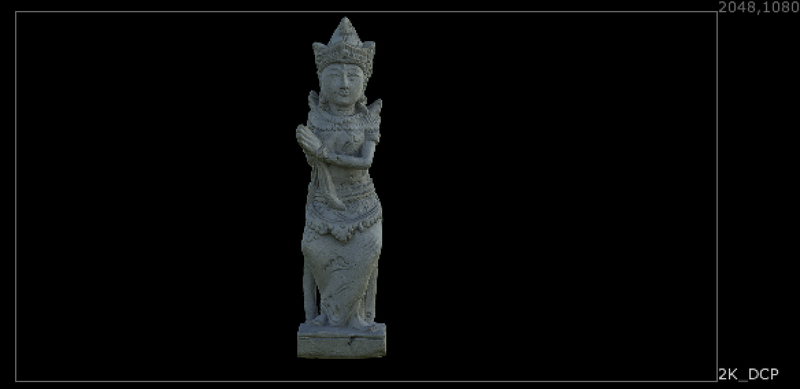
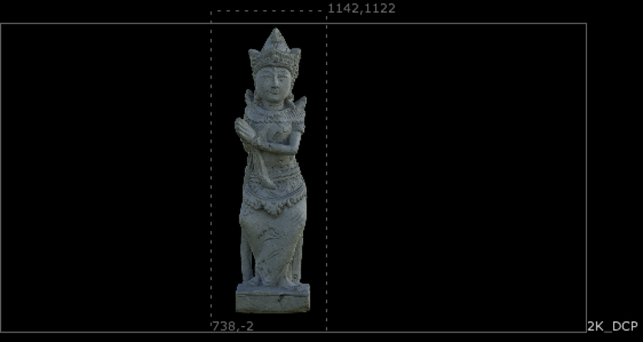
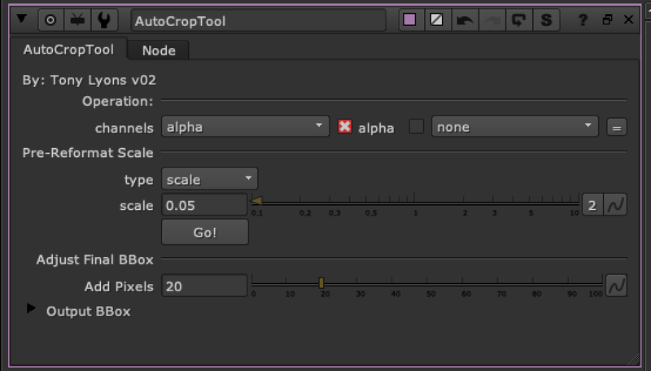

# AutoCropTool TL

**Author:** Tony Lyons - [https://www.CompositingMentor.com](https://www.CompositingMentor.com)

AutoCropTool runs a curvetool node autocrop process on a scaled down single channel version of the input image. Use this to generate a quick bounding box on CG renders or other elements without a defined bounding box. Keeping your bounding box tight and isolated to only the important part of the frame will save processing time in nuke.

