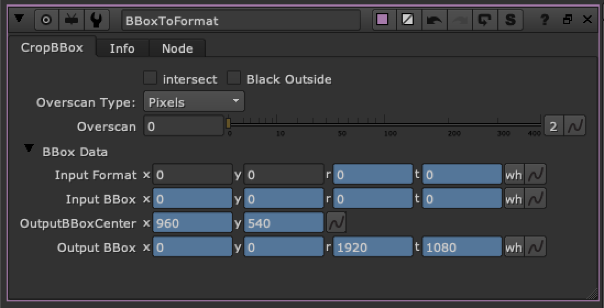

# BBoxToFormat TL

**Author:** Tony Lyons - [https://www.CompositingMentor.com](https://www.CompositingMentor.com)

BBoxToFormat sets your bbox exactly to the input format.

You also have options for either a percentage overscan or pixel based overscan. This is a good way to manage your bbox while keeping some extra overscan for distortion or cameraShake, etc when you are using CG with overscan or additional elements.

The intersect option will take the intersection of the input format with the input bbox.

Exposed data for input format, input bbox, output BBox Center, and Output BBox in a group tab because sometimes it's useful to reference.
