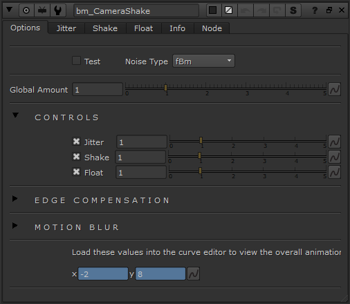

# CameraShake BM

**Author:** Ben McEwan - [https://benmcewan.com/blog/](https://benmcewan.com/blog/)

- [http://www.nukepedia.com/gizmos/transform/bm_camerashake/](http://www.nukepedia.com/gizmos/transform/bm_camerashake/)
- [http://benmcewan.com/nukeTools.html](http://benmcewan.com/nukeTools.html)

A replacement for Nuke's default camera shake node -- offers more control over 3 different frequencies of camera shake, and also shakes the centre-point, giving more detail to sub-frame motionblur. Also has options for how to deal with edge-of-frame pixels, so pushing in isn't always your best option anymore!
