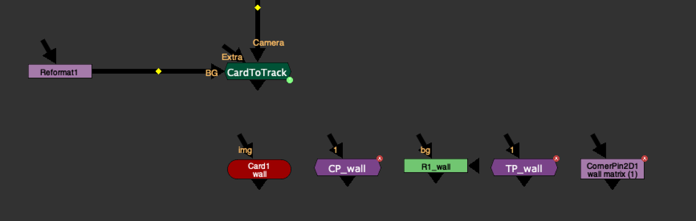
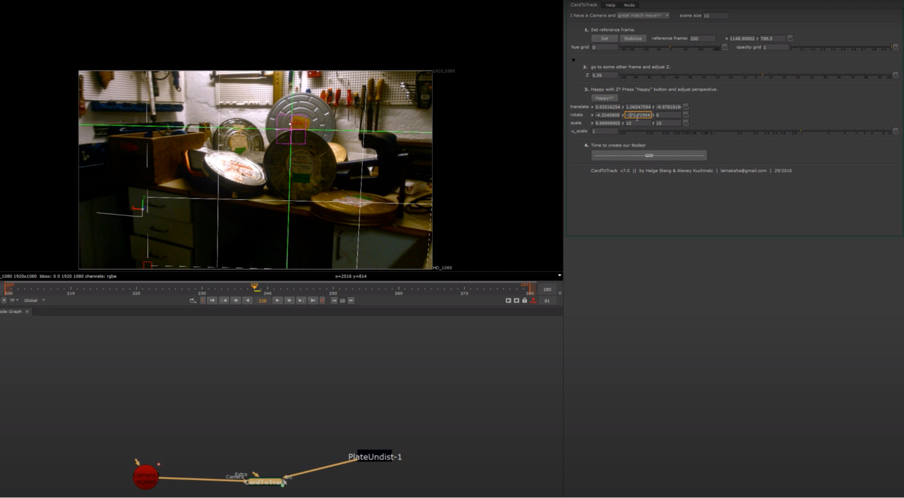

# CardToTrack AK

**Author:** Adrian Kiriel

- [http://www.nukepedia.com/python/3d/cardtotrack](http://www.nukepedia.com/python/3d/cardtotrack)

Finding position in 3D space based on Geometry, World position pass, Deep or manual method. Reconcile 3D position to CornerPin, Transform and Roto nodes.
### Features:
**Calculation from an Axis:** Many times we are provided with an animated Axis. In previous versions I was copying values from an Axis to the card and calculating, the problem is that if by default an axis had an unfortunate rotation like 90 degrees to the camera it was impossible to adjust it. With the Axis option you can connect a few Axises together and Card to track will calculate the animation from the world matrix of the Axis you connected to with CardToTrack. (Supports animated Axises)
**Calculation from Deep:** Connect your Deep footage to the Extra input. (The position sampled on the reference frame and can not be animated)
**UI changes:** Knob Groups are presented only if they are relevant.

