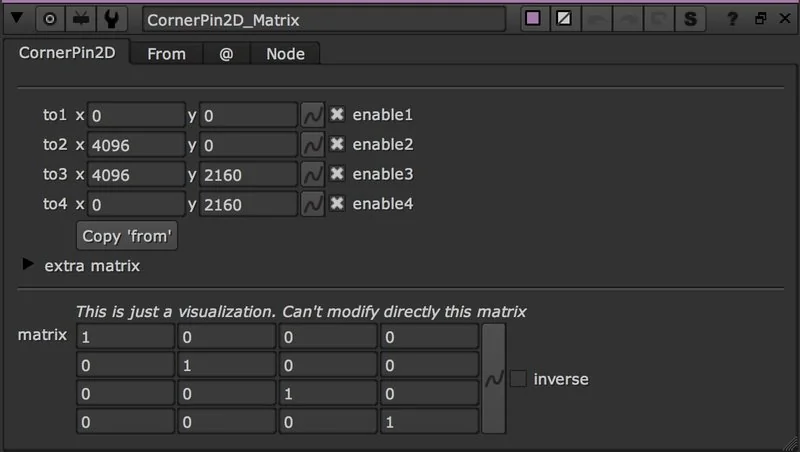
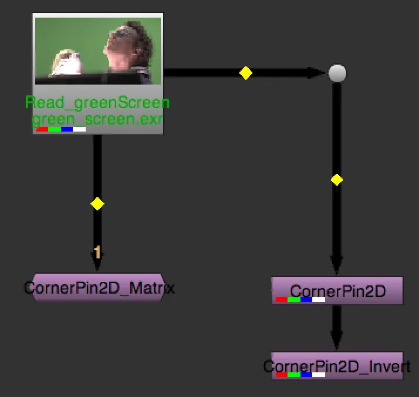

# CornerPin2D_Matrix AG

**Author:** Andrea Geremia - [http://www.andreageremia.it/tutorial.html](http://www.andreageremia.it/tutorial.html)

- [http://www.nukepedia.com/gizmos/transform/cornerpin-matrix](http://www.nukepedia.com/gizmos/transform/cornerpin-matrix)
- [http://www.andreageremia.it/tutorial_matrix_transform.html](http://www.andreageremia.it/tutorial_matrix_transform.html)

Get the classic CornerPin node in a Matrix 4x4.

There is a checkbox useful to invert the Matrix. In this case we can copy the matrix in another CornerPin and the copy the inverse matrix in another CornerPin. The final result will be the original picture.

