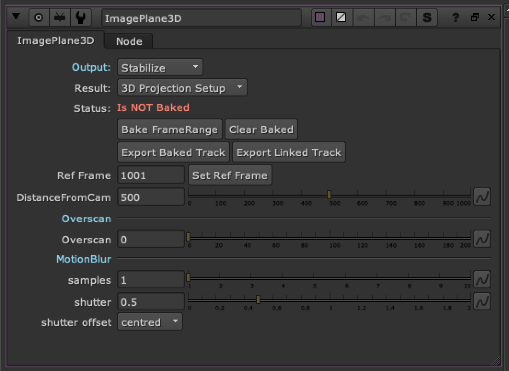

# ImagePlane3D TL

**Author:** Tony Lyons - [https://www.CompositingMentor.com](https://www.CompositingMentor.com)

Based off the great imagePlane tool by Frank Rueter on nukepedia:

[http://www.nukepedia.com/gizmos/transform/imageplane](http://www.nukepedia.com/gizmos/transform/imageplane)

The original imagePlane node seems to have a problem with stabilizing the image, and then reverting the stabilized image back to the original position by matchmoving. Unfortunately, not being able to reliably restore the stabilized image back to the original position meant your rotos and prep work or whatever positioning you were doing was not guaranteed to matchmove back into the original footage. This tool aims to solve this problem and offering a few extra features.

### Output

Choose between stabilize and matchmove

### Result Modes

**3D Projection Setup** - This is using 3d nodes, cards and camera projections to guarantee no funkiness and that the stabilize/matchmove process will be reversible. Unfortunately the 3d projection setup will be the slowest option, but it will be a clean preview.

**card3D setup** - This is using the same method as the original imagePlane node, for some reason, this method creates the problem of stabilizing and reversing the movement when matchmoving. It is however very fast because there is no 3D scanline render and calculates as a 2d cornerpin. This will either give you identical or very similar results to the 3D projection setup but is prone to this "unreversible" result. Good mode for finding the stabilized distance quickly.

**Live (Reconcile 3D)** - This is by far the fastest calculation for this stabilization process and is recommended for quick previews and finding the stabilization distance. However when using nuke's reconcile 3D node with live points, it gets very buggy. Some frames are black, other frames 'explode' and seem to lose the 3d points for reference. Proxy mode or lower resolution preview will be buggy or not work. In theory it should be the exact same result as the 3d Projection setup, so the stabilization/matchmove workflow is intact, but it's very buggy, especially when rendering. Do not leave on this live mode, purely use it as a quick preview to find the stabilization distance and ensure accuracy.

**Baked (Cornerpin)** - When you bake the framerange, it will switch to this mode in order to save calculation time, and to eliminate the bugginess of the stabilization/matchmove workflow from the "live" previews.

### Controls

**Status:** Will tell you the status of the node, whether it is Live or baked (and what framerange)

**Ref Frame:** This frame is the stabilization pivot frame of the stabilization/matchmove and will be unaffected / have zero transformations

**Distance from Cam:** This number is the distance from camera in nuke units to place the stabilization card. Sometimes you roughly know the distance from the camera that the object you are trying to stabilize is, and other times you can just eyeball distance by moving away from your reference frame in the timeline and changing the distance until object remains in the same position in the screen as it was in the reference frame. Using the color picker to 'save' a position can sometimes help you line up the object position over multiple frames.

**Bake FrameRange:** This will create a baked cornerpin based off the ref frame and distance from camera. It's recommended to run this once you are happy with your stabilization result because it will not only be less prone to nuke's bugginess from the other live setups but it will also be a lot faster since it is baked and not calculating anything live with expressions or 3D setups. Warning: this may take awhile as it is running a reconcile3D for each of the 4 points over the desired framerange. Large frameranges can take some time, and unfortunately there is no feedback on how long it is taking, so nuke may appear to freeze. Just be patient and it will work, normally it is a very fast process.

**Clear baked:** Clears the keyframes and reverts the node back to live. Sets to default.

**Export Baked Track / Export Linked Track:** These 2 buttons are acting like the export cornerpin button in nuke's 2d Tracker node. They will export a cornerpin node that is stabilized or matchmoved (depending on the output you have selected). This way you can use the cornerpin elsewhere in your script and won't have to duplicate this 'heavy' node. Please note, expression linked cornerpin, while convenient, will be slower in nuke to calculate than a baked result, so choose wisely.

There are some additional settings i have added to the cornerPin node for convenience of use for you. There are controls for settings and changing the reference frame that you want. And also 2 buttons to switch the cornerpin between stabilize and matchmove.

**Overscan:** A simple setting to manage your bbox and set an overscan allowance (in pixels). This will be important when distorting and undistorting your image. Once you bake the cornerpin this shouldn't matter too much, mostly for the 3d projection setup scanline render overscan.

**Motion Blur:** Ability to add motionblur for your matchmove result based on either samples on the scanline render or motion blur knob on the card3D or cornerpin node.
