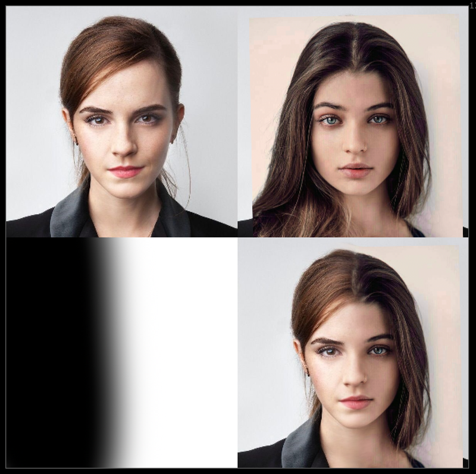
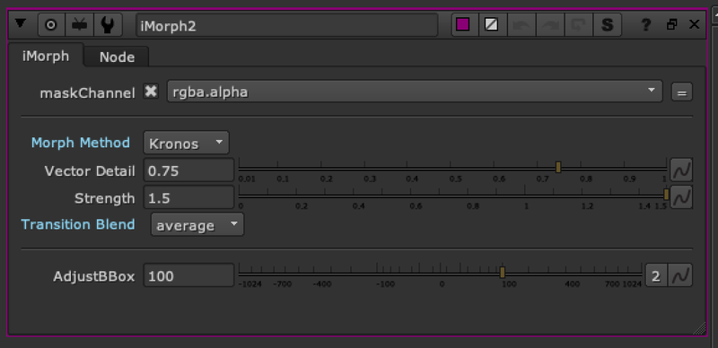

# iMorph AP

**Author:** Adrian Pueyo - [http://www.adrianpueyo.com/](http://www.adrianpueyo.com/)

- [http://www.nukepedia.com/gizmos/transform/morph_dissolve](http://www.nukepedia.com/gizmos/transform/morph_dissolve)
- [http://www.nukepedia.com/gizmos/time/timemachine](http://www.nukepedia.com/gizmos/time/timemachine)

IMorph is a spin-off of MorphDissolve from Erwan Leroy and SPIN FX gizmo set. It's also inspired by the TimeMachine gizmo by Ivan Busquets.

MorphDissolve uses 2 images and has a slider from 0-1 to determine how much morphing there is. IMorph, similar to IBlur or ITransform, uses a Mask input to determine where image A is shown and where image B is shown and then morph-dissolves in steps from A to B in between, which produces really smooth transitions from 1 image into another.

Updated to use blink script for extra speed. By default, when nothing is plugged into mask input, the node is an A - B morph same as Morph Dissolve, but faster. When mask is plugged in, 0 = A and 1 = B and the grey pixels determine the morph zone.

